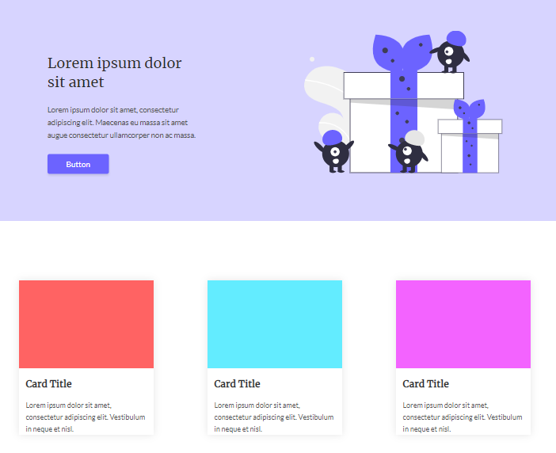

# Desafio 03 Codelândia

Trabalho desenvolvido para o Desafio 03 da Codelândia.

# Links

Deploy > https://viniciusgalmeida.github.io/Desafio-03-Codelandia/ 

Figma do desafio > https://www.figma.com/file/Yb9IBH56g7T1hdIyZ3BMNO/Desafios---Codel%C3%A2ndia?node-id=3725%3A2 

# Feito com:

